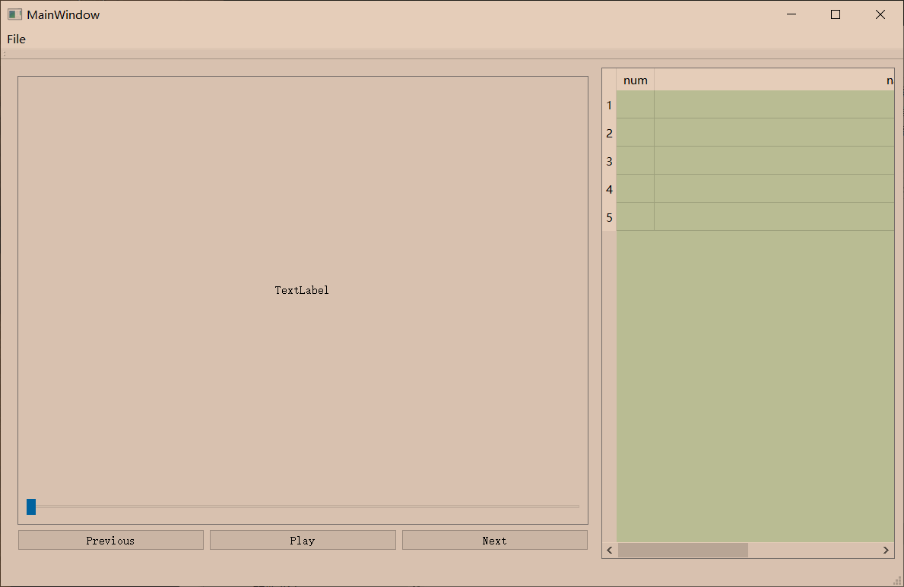

# C++ Qt 简单视频播放器实现

## 打包应用程序

- [Qt5 + opencv 程序打包发布- csdn](https://blog.csdn.net/WLFF_CSDN/article/details/51350524)
- [Qt 程序通过 enigma virtual box 工具封包，生成单独的 *.exe 文件 - csdn](https://blog.csdn.net/gongjianbo1992/article/details/80863247)

>注意选择正确的命令行终端（32 bit or 64 bit）

